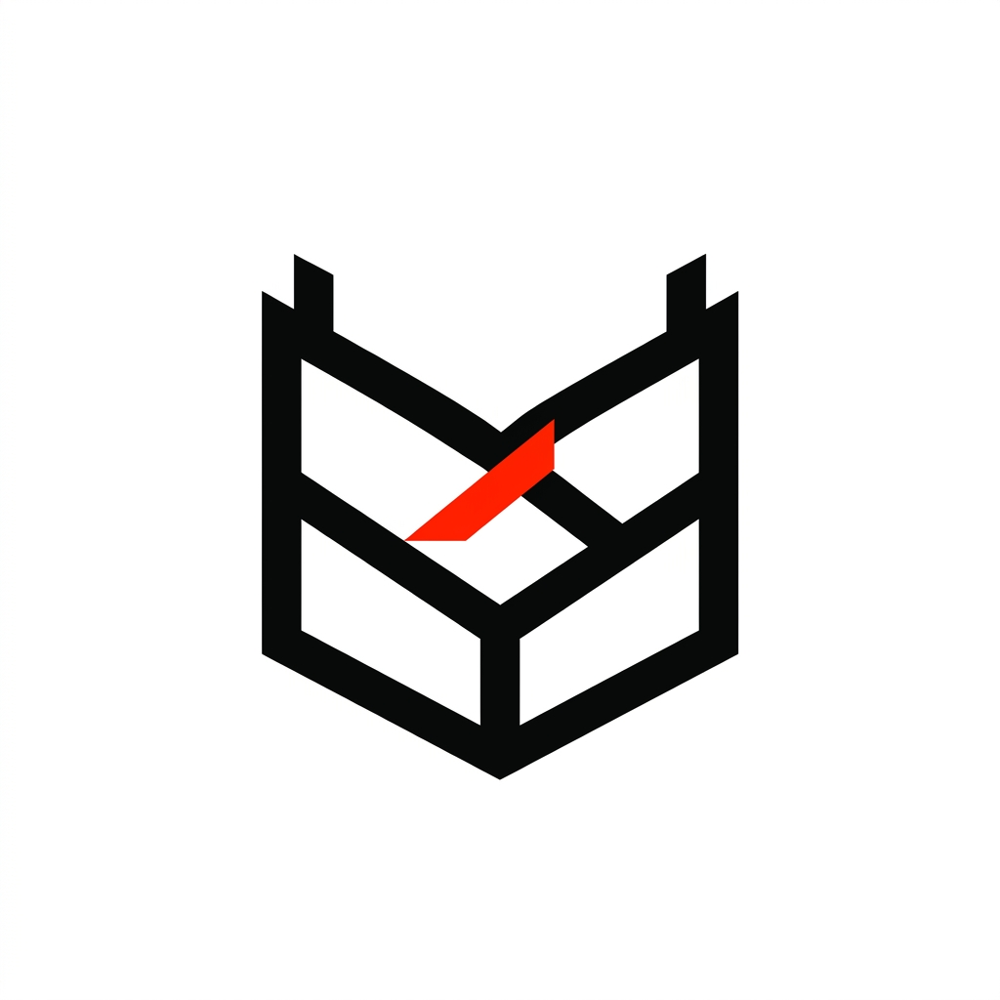

<p align="center">
  
</p>

<h1 align="center">Pactix</h1>

<p align="center">
  <strong>The Autonomous Agentic Negotiator for Modern Freelancers and Agencies.</strong>
</p>

<p align="center">
  
  
  
</p>

---

## 🚀 What is Pactix?

Freelancers lose thousands of dollars every year under-pricing themselves, accepting bad terms, and spending unbillable hours going back-and-forth negotiating scopes. 

**Pactix** is a powerful SaaS that acts as your AI legal and negotiation team. When a client emails you, Pactix convenes a **Council of Six Specialist AI Agents** that deliberate in real-time. They research the client, identify scope creep, calculate optimal anchor pricing, and draft a response perfectly cloned in your authentic voice.

**It doesn't just draft emails — it closes deals.** Once the terms are agreed upon, Pactix automatically generates a bulletproof PDF contract and a Stripe payment link, sending it to the client to sign and pay.

---

## ✨ Features

### 1. 🤖 The Council of Agents
Pactix doesn't rely on a single LLM prompt. It uses a multi-agent orchestration architecture:
1. **Orchestrator** — classifies the message (new lead, counter-offer, scope change, etc.)
2. **Scout** — researches the client company for spend signals and leverage
3. **Prosecutor** — red-flags scope, timeline, and pricing risks
4. **Defense** — builds the case for the freelancer's floor rate and anchor
5. **Judge** — weighs both sides and issues a ruling with a win probability
6. **Negotiator** — drafts the reply in the freelancer's authentic voice (few-shot style transfer from past sent emails)

### 2. 🌍 Multi-Language Auto-Detect
Working globally? The Orchestrator automatically detects the language of an inbound lead (e.g., French, Japanese). The Council deliberates in English, but the Negotiator translates and drafts the final email perfectly in the client's language while maintaining your voice.

### 3. 🎙️ Voice I/O Dictation
No more typing. When Pactix drafts an email, open the Approve Reply modal, hit **Dictate**, and use the Web Speech API to verbally inject new context or modifications into the draft before sending.

### 4. 🔍 Redline Agent
Clients sent their own scope terms? The Redline Agent adversarially scans the contract scope to flag **Critical, Major, and Minor** risks—such as unlimited revisions, low deposits, or missing kill fees.

### 5. 🎲 Monte Carlo What-If Simulator
Curious what happens if you push for more money? Run the Monte Carlo Simulator to execute 200 parallel realities of the negotiation. View beautiful distribution histograms charting your **Expected Value (EV)** versus **Win Probability**.

### 6. ⏪ Cinematic Deal Replay
Share the magic of AI deliberation. Pactix saves every agent's thought process into immutable traces. Use the Deal Replay transport controls (1x - 8x speed) to visually scrub through exactly how the agents arrived at their decision. 

Generate a public, read-only link (`/share/[id]`) to show your friends or colleagues.

### 7. ⌨️ Global Command Palette
Hit `⌘ + K` anywhere in the app to instantly search deals, jump between inbox threads, or trigger global actions.

---

## 🏗️ Architecture & Tech Stack

Pactix is built for scale, speed, and real-time streaming.

```text
           ┌──────────────┐
Client     │  Orchestrator│  — classify message
  email  → └──────┬───────┘
                  │
         ┌────────┼────────┐
         ▼        ▼        ▼
      Scout  Prosecutor  Defense       (parallel)
         │        │        │
         └────────┼────────┘
                  ▼
              ┌───────┐
              │ Judge │  — weighs all three, issues ruling
              └───┬───┘
                  ▼
           ┌────────────┐
           │ Negotiator │  — drafts reply in freelancer's voice
           └─────┬──────┘
                 │
                 ▼
    ┌────────────────────────┐
    │ Human approval gate    │  ← edit inline, send
    └────────┬───────────────┘
             │  (on Judge.decision === "accept")
             ▼
    ┌────────────────────────┐
    │ Contract (PDF) + Stripe│  — autonomous closing
    └────────────────────────┘
```

- **Frontend**: Next.js 15 (App Router), React 19, Tailwind CSS (Custom "Editorial Light" Design System), Framer Motion.
- **Backend**: Next.js API Routes, Server-Sent Events (SSE) for live streaming agent deliberations.
- **Database**: PostgreSQL (via Supabase) and Prisma ORM.
- **AI Core**: Google Gemini 2.0 Flash (Swappable to OpenAI or Baidu ERNIE).
- **Payments**: Stripe native SDK.
- **Document Generation**: `pdf-lib` for autonomous SOW creation.

---

## 🛠️ Quick Start (Vercel / Supabase Production Ready)

Deploying Pactix is incredibly simple. 

### 1. Clone & Install
```bash
git clone https://github.com/yourusername/pactix.git
cd pactix
npm install
```

### 2. Environment Variables
Copy the `.env.example` file to `.env`:
```bash
cp .env.example .env
```
Fill out the variables. You will need:
- **Supabase**: Create a free Supabase project. Get your Connection Pooler URLs (Port 6543 for `DATABASE_URL` and Port 5432 for `DIRECT_URL`).
- **Gemini**: Get a free API key from Google AI Studio.
- **Stripe**: Get your test keys (`sk_test_...` and `pk_test_...`) from the Stripe Developer Dashboard.

### 3. Database Push & Seed
Sync your Supabase database and seed it with the Hero Demo Data:
```bash
npm run db:push
npx tsx prisma/seed.ts
```

### 4. Run Locally
```bash
npm run dev
```
Navigate to `http://localhost:3000`.

---

## 🚀 One-Click Deploy to Vercel

Pactix is optimized for Vercel Serverless deployments. 

1. Push your repository to GitHub.
2. Go to Vercel and import the project.
3. In the Environment Variables section, paste everything from your `.env` file (Ensure your Supabase connection strings are correct).
4. Click **Deploy**.


## ⚖️ License
[MIT License](https://opensource.org/licenses/MIT) - See [LICENSE](LICENSE) for details.
